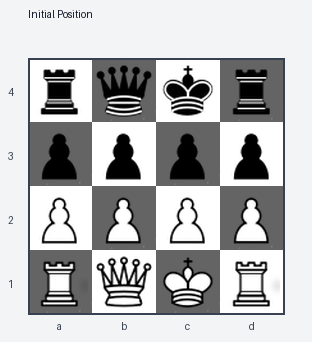
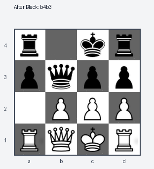

# Minichess Tree AI

This is a small project where I experimented with game trees and simple AI strategies in a 4x4 minichess setup.

## What this project does

I built a tree-based system that:

- stores move sequences from past games
- tracks a White win-probability value through the tree
- generates full game trees up to a chosen depth
- plays games using two strategies:
  - random from tree knowledge (or random fallback)
  - greedy choice based on win probability

## Main files

- `a2_game_tree.py` — core tree structure + insertion/probability updates
- `a2_part1.py` — load game data + random tree player
- `a2_part2.py` — complete game-tree generation + greedy player
- `a2.tex` — my written math notes on game-tree growth
- `data/` — sample game data

## Overall concepts

- recursive tree construction
- decision-making from tree statistics
- handling huge branching processes (combinatorial growth)

## Chessboard visualization

Initial position:



After White plays `a2b3`:


After Black replies `b4b3`:



## Run locally

```bash
python3 a2_part1.py
python3 a2_part2.py
```

Remark: Built as part of a CSC111 assignment.
